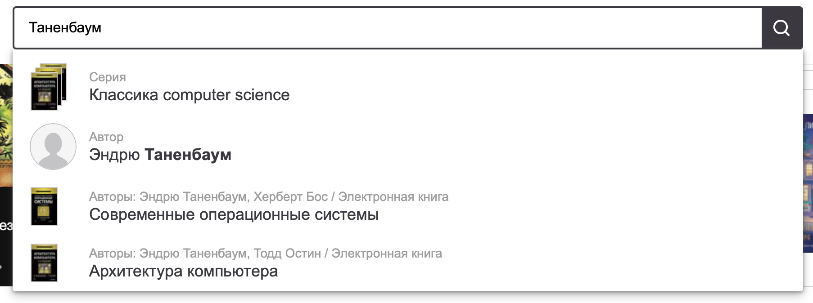

# Требования к проекту

## Содержание

[1 Введение](#1-введение)  
[1.1 Назначение](#11-назначение)  
[1.2 Бизнес-требования](#12-бизнес-требования)  
[1.2.1 Исходные данные](#121-исходные-данные)  
[1.2.2 Возможности бизнеса](#122-возможности-бизнеса)  
[1.2.3 Границы проекта](#123-границы-проекта)  
[1.3 Аналоги](#13-аналоги)  
[2 Требования пользователя](#2-требования-пользователя)  
[2.1 Программные интерфейсы](#21-программные-интерфейсы)  
[2.2 Интерфейс пользователя](#22-интерфейс-пользователя)  
[2.3 Характеристики пользователей](#23-характеристики-пользователей)  
[2.3.1 Классы пользователей](#231-классы-пользователей)  
[2.3.2 Аудитория приложения](#232-аудитория-приложения)  
[2.3.2.1 Целевая аудитория](#2321-целевая-аудитория)  
[2.3.2.2 Побочная аудитория](#2322-побочная-аудитория)  
[2.4 Предположения и зависимости](#24-предположения-и-зависимости)  
[3 Системные требования](#3-системные-требования)  
[3.1 Функциональные требования](#31-функциональные-требования)  
[3.1.1 Основные функции](#311-основные-функции)  
[3.1.1.1 Поиск книг (главное меню)](#3111-поиск-книг-(главное-меню))  
[3.1.1.2 Поиск книг (окно выбора)](#3112-поиск-книг-(окно-выбора))   
[3.1.2 Ограничения и исключения](#312-ограничения-и-исключения)  
[3.2 Нефункциональные требования](#32-нефункциональные-требования)  
[3.2.1 Атрибуты качества](#321-атрибуты-качества)  
[3.2.1.1 Требования к удобству использования](#3211-требования-к-удобству-использования)  
[3.2.1.2 Требования к безопасности](#3212-требования-к-безопасности)  
[3.2.2 Внешние интерфейсы](#322-внешние-интерфейсы)  
[3.2.3 Ограничения](#323-ограничения)

# 1 Введение

## 1.1 Назначение

В этом документе описаны функциональные и нефункциональные требования к веб-приложению 'Leninka'. Этот документ 
предназначен для команды, которая будет реализовывать и проверять корректность работы приложения.

## 1.2 Бизнес-требования

### 1.2.1 Исходные данные

Большое количество людей разной возрастной категории ежедневно пользуются различными площадками поиска нужных книг, в том 
числе сайты в интернете, радиовещание, брошурки, газеты и так далее. За частую приходится преодолевать различное расстояние, 
тратить уйму сил и энергии для получения нужной информации и желаемого результата. И после этого не всегда удается достичь 
задумываемого, приходится искать ответы на свои вопросы в интернете, но и здесь получают достатоное количество трудностей, и
пытаясь упростить себе задачу люди тратят много сил и времени, после чего приходит понимание того, что вопросов стало только больше,
а проблема в корне не решена.

### 1.2.2 Возможности бизнеса

Многие люди разумеется для их же удобства хотят иметь сервис, который позволит получать нужную информацию по данной теме, покупать 
книги которые отвечают их интересам, затрачивая по минимуму время и силы. Сервис находит лучшие варианты книг,
которые можно оплатить через сервис. Интерфейс, спроектированный так, чтоб пользователю было легко и 
просто получить желаемое, не затрачивая лишних средств.

### 1.2.3 Границы проекта

Сервис 'Leninka' позволит зарегистрированным пользователям найти и купить самые дешевые книги. Поиск книг по интересам, темам, авторам и названию. Принцип простой:

1.Пользователь заходит на сайт, проходит быстрый тест на определение интересов.

2.Сервис в реальном времени обрабатывает тест и отдает книги по полученому результату.

3.Все книги отображаются на одной странице, начиная от подходящих.

4.Пользователь выбирает подходящию книги и переходят на страницу описания, где может ее купить.

## 1.3 Аналоги

Обзор аналогов представлен в документе [analogues](analogues.md).

# 2 Требования пользователя

Информация о книгах будет браться с разных сервисов и источников.

## 2.1 Программные интерфейсы

Главное меню приложения:  

  

Поиск книг:  

  

Дополнеительная информация о книге:  

  

## 2.3 Характеристики пользователей

### 2.3.1 Классы пользователей

| Класс пользователей | Описание                                                                                              |
|:--------------------|:------------------------------------------------------------------------------------------------------|
| Без доступа к сети  | Пользователи, не имеют доступ к сервису.							      |
| С доступом к сети   | Пользователи, которые имеют доступ к сети. Имеют доступ к полному функционалу                         |

### 2.3.2 Аудитория приложения

#### 2.3.2.1 Целевая аудитория

Люди любой возрастной категории, обладающие минимальными навыками работы с ПК и в сети интернет, интересующиеся книгами.

#### 2.3.2.2 Побочная аудитория

Люди которые занимаются в сфере бизнеса, заинтересованные в заработке на продаже книг например авторы.

## 2.4 Предположения и зависимости

Сервис не работает при отсутствии подключения к Интернету;

# 3 Системные требования

## 3.1 Функциональные требования

### 3.1.1 Основные функции

#### 3.1.1.1 Поиск книг (главное меню)

**Описание:** Пользователь имеет возможность поиска, сравнения и покупки книг.

| Функция                              | Требования                                                                                                                                                                                                                                                                                               | 
|:-------------------------------------|:---------------------------------------------------------------------------------------------------------------------------------------------------------------------------------------------------------------------------------------------------------------------------------------------------------|
| Выбор темы               | Приложение предоставляет на выбор популярные темы                                                                                                                                                                                                                   		  |
| Выбор автора 	               | Приложение предоставляет на выбор популярных авторов по теме.                                                                                                                                                                                 				              		  |
| Выбор года		               | Приложение предоставляет встроенный календарь с датами выхода книг.                                                                                                                                                       										  |
| Выбор названия книги	               | Приложение предоставляет на выбор все книги по заданному автору и теме(необязательное поле).																										  |

#### 3.1.1.2 Поиск книг (окно выбора)

**Описание:** Пользователь имеет возможность редактирования, сравнения и покупки конкретной книги.

| Функция                              | Требования                                                                                                                                                                                                                                                                                               | 
|:-------------------------------------|:---------------------------------------------------------------------------------------------------------------------------------------------------------------------------------------------------------------------------------------------------------------------------------------------------------|
| Редактирование темы     | Приложение предоставляет редактирование темы для поиска.                                                                                                                                                                                                                     |
| Редактирование автора        | Приложение предоставляет редактирование автора книги.                                                                                                                                                                                 				     		  |
| Редактирование даты		       | Приложение предоставляет встроенный календарь с датами выхода книг для редактирования.                                                                                                                                                       								  |
| Редактирование названия книги       | Приложение предоставляет возможность поиска книги по названию(необязательное поле).																										  |
| Выбор конкретной книги             | Приложение предоставляет на выбор книги с автора, названия, даты и цены.        																												  |
### 3.1.2 Ограничения и исключения

Приложение функционирует только при наличии подключения к Интернету;

## 3.2 Нефункциональные требования

### 3.2.1 Атрибуты качества

#### 3.2.1.1 Требования к удобству использования

1. Интерфейс удобный для пользования

2. Функциональные элементы не перегружают экран;

#### 3.2.1.2 Требования к безопасности

Для совершения покупок требуется
предпринять дополнительные меры безопасности во избежание потери денежных средств.

### 3.2.2 Внешние интерфейсы

Окна приложения удобны для долгосрочного использования пользователями:

* функциональные элементы не утомляют глаза.
* стандартная цветовая палитра не утомляет глаза.

### 3.2.3 Ограничения

Приложение реализовано на Golang/Gin    																												  